# Kubernetes Submissions

📘 DevOps with Kubernetes – Exercise Repository

This repository contains my completed exercises for the **DevOps with Kubernetes** course.
Each exercise links to its own branch and includes screenshots as proof of completion.

---

## 🚀 Quick Navigation – All Exercises

Click an exercise number to jump directly to its section.

| Chapter       | Exercises                                                                                                                                                                      |
| ------------- | ------------------------------------------------------------------------------------------------------------------------------------------------------------------------------ |
| **Chapter 1** | [1.1](#11) · [1.2](#12) · [1.3](#13) · [1.4](#14) · [1.5](#15) · [1.6](#16) · [1.7](#17) · [1.8](#18) · [1.9](#19) · [1.10](#110) · [1.11](#111) · [1.12](#112) · [1.13](#113) |
| **Chapter 2** | [2.1](#21) · [2.2](#22) · [2.3](#23) · [2.4](#24) · [2.5](#25) · [2.6](#26) · [2.7](#27) · [2.8](#28) · [2.9](#29) · [2.10](#210)                                              |
| **Chapter 3** | [3.1](#31) · [3.2](#32) · [3.3](#33) · [3.4](#34) · [3.5](#35) · [3.6](#36) · [3.7](#37) · [3.8](#38) · [3.9](#39) · [3.10](#310) · [3.11](#311) · [3.12](#312)                |
| **Chapter 4** | [4.1](#41) · [4.2](#42) · [4.3](#43) · [4.4](#44) · [4.5](#45) · [4.6](#46) · [4.7](#47) · [4.8](#48) · [4.9](#49) · [4.10](#410)                                              |
| **Chapter 5** | [5.1](#51)                                                                                                                                                                     |

---

## 📊 Progress Overview

| Chapter   | Exercises Completed |
| --------- | ------------------- |
| Chapter 1 | 1.1 – 1.13          |
| Chapter 2 | 2.1 – 2.10          |
| Chapter 3 | 3.1 – 3.12          |
| Chapter 4 | 4.1 – 4.10          |
| Chapter 5 | 5.1                 |

---

## 🧩 Chapter 1 – Getting Started

###  Exercise 1.1

- Branch: [1.1](https://github.com/VienThanh12/DevOps-with-Kubernetes/tree/1.1)
- Evidence:
  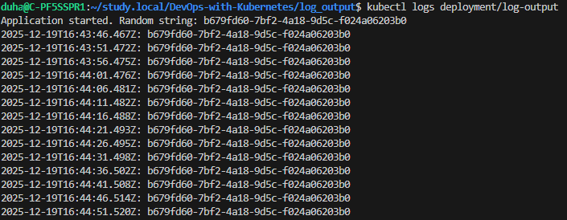

###  Exercise 1.2

- Branch: [1.2](https://github.com/VienThanh12/DevOps-with-Kubernetes/tree/1.2)
- Evidence:
  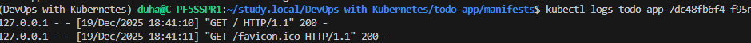

###  Exercise 1.3

- Branch: [1.3](https://github.com/VienThanh12/DevOps-with-Kubernetes/tree/1.3)

###  Exercise 1.4

- Branch: [1.4](https://github.com/VienThanh12/DevOps-with-Kubernetes/tree/1.4)

###  Exercise 1.5

- Branch: [1.5](https://github.com/VienThanh12/DevOps-with-Kubernetes/tree/1.5)
- Evidence:
  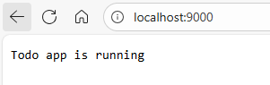
  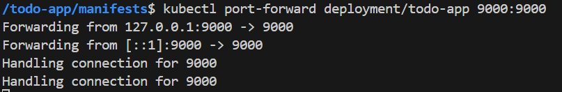

###  Exercise 1.6

- Branch: [1.6](https://github.com/VienThanh12/DevOps-with-Kubernetes/tree/1.6)
- Evidence:
  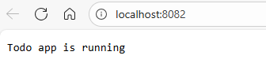

###  Exercise 1.7

- Branch: [1.7](https://github.com/VienThanh12/DevOps-with-Kubernetes/tree/1.7)
- Evidence:
  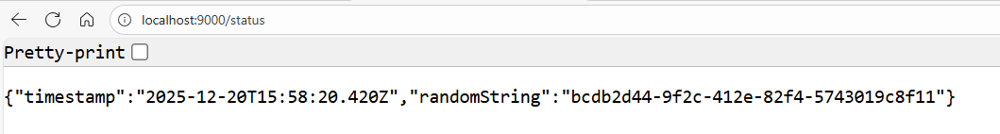

###  Exercise 1.8

- Branch: [1.8](https://github.com/VienThanh12/DevOps-with-Kubernetes/tree/1.8)

###  Exercise 1.9

- Branch: [1.9](https://github.com/VienThanh12/DevOps-with-Kubernetes/tree/1.9)
- Evidence:
  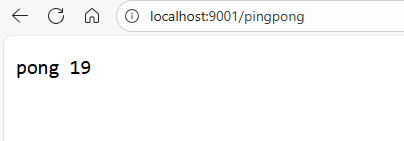

###  Exercise 1.10

- Branch: [1.10](https://github.com/VienThanh12/DevOps-with-Kubernetes/tree/1.10)
- Evidence:
  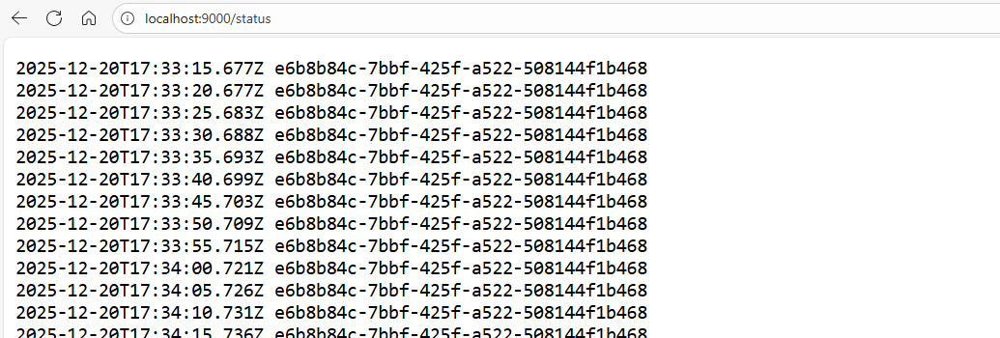
  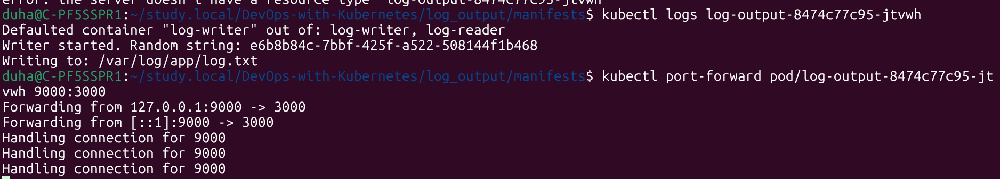

###  Exercise 1.11

- Branch: [1.11](https://github.com/VienThanh12/DevOps-with-Kubernetes/tree/1.11)
- Evidence:
  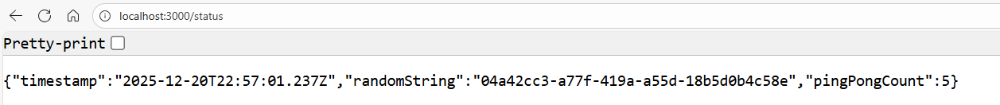
  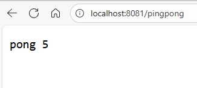

###  Exercise 1.12

- Branch: [1.12](https://github.com/VienThanh12/DevOps-with-Kubernetes/tree/1.12)
- Evidence:
  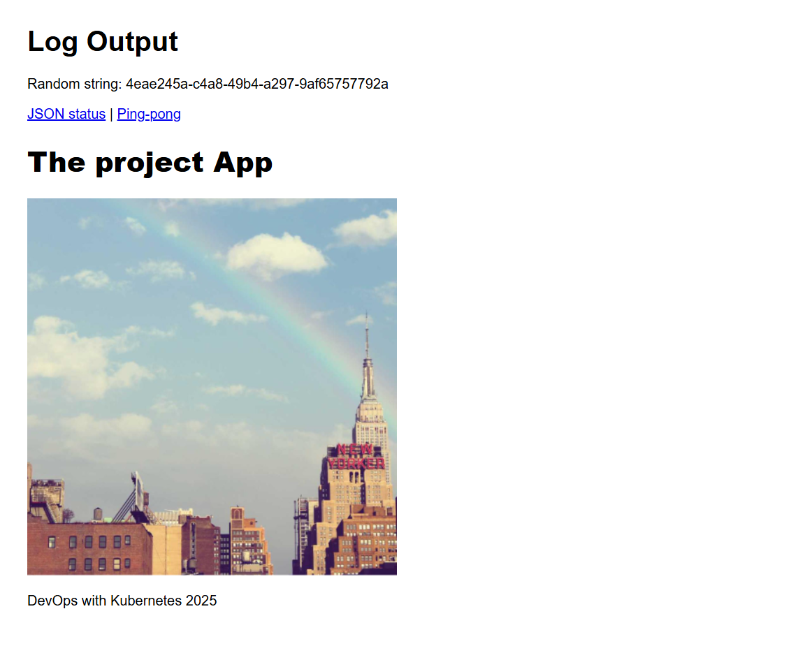

###  Exercise 1.13

- Branch: [1.13](https://github.com/VienThanh12/DevOps-with-Kubernetes/tree/1.13)
- Evidence:
  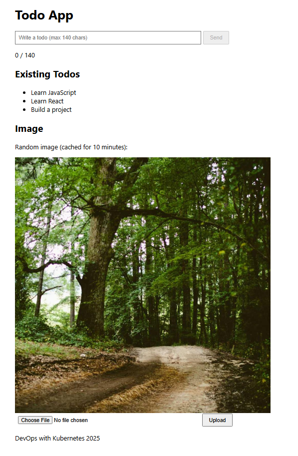

---

## 🧩 Chapter 2 – Kubernetes Basics

###  Exercise 2.1

- Branch: [2.1](https://github.com/VienThanh12/DevOps-with-Kubernetes/tree/2.1)
- Evidence:
  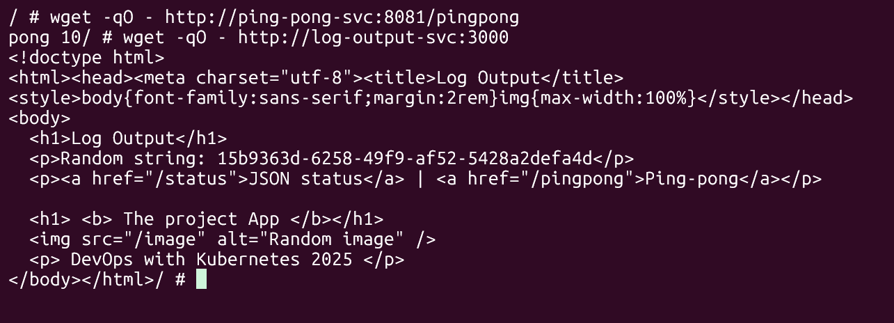
  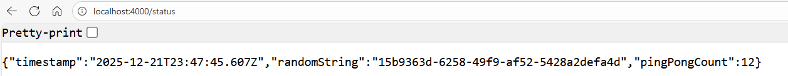
  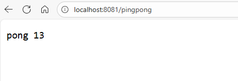

###  Exercise 2.2

- Branch: [2.2](https://github.com/VienThanh12/DevOps-with-Kubernetes/tree/2.2)
- Evidence:
  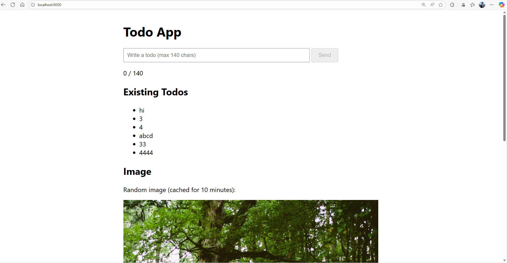
  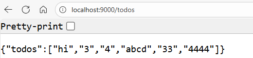

###  Exercise 2.3

- Branch: [2.3](https://github.com/VienThanh12/DevOps-with-Kubernetes/tree/2.3)
- Evidence:
  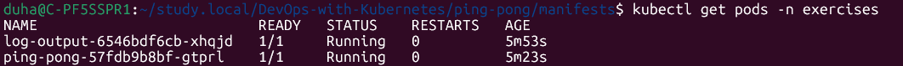
  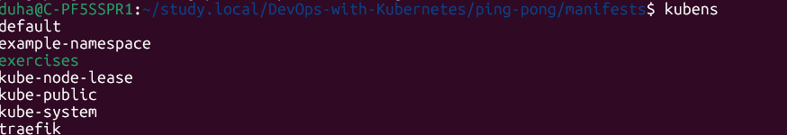

###  Exercise 2.4

- Branch: [2.4](https://github.com/VienThanh12/DevOps-with-Kubernetes/tree/2.4)
- Evidence:
  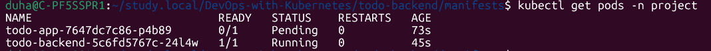
  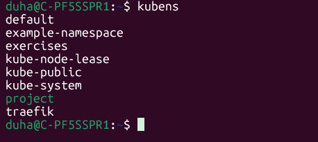

###  Exercise 2.5

- Branch: [2.5](https://github.com/VienThanh12/DevOps-with-Kubernetes/tree/2.5)
- Evidence:
  

###  Exercise 2.6

- Branch: [2.6](https://github.com/VienThanh12/DevOps-with-Kubernetes/tree/2.6)
- Evidence:
  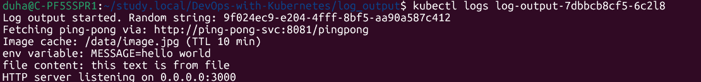

###  Exercise 2.7

- Branch: [2.7](https://github.com/VienThanh12/DevOps-with-Kubernetes/tree/2.7)
- Evidence:
  

###  Exercise 2.8

- Branch: [2.8](https://github.com/VienThanh12/DevOps-with-Kubernetes/tree/2.8)
- Evidence:
  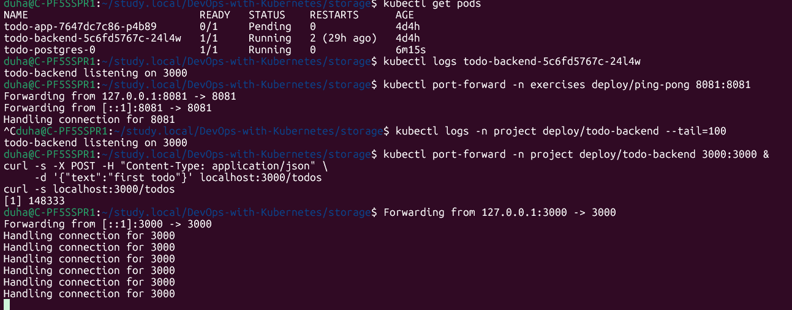
  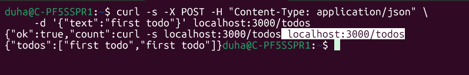

###  Exercise 2.9

- Branch: [2.9](https://github.com/VienThanh12/DevOps-with-Kubernetes/tree/2.9)
- Evidence:
  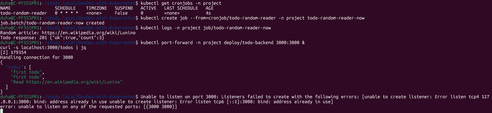

###  Exercise 2.10

- Branch: [2.10](https://github.com/VienThanh12/DevOps-with-Kubernetes/tree/2.10)
- Evidence:
  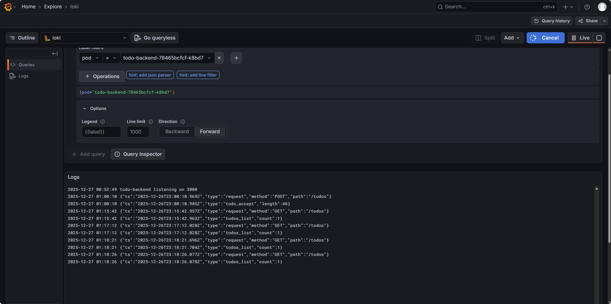

---

## 🧩 Chapter 3 – More Building Blocks

###  Exercise 3.1

- Branch: [3.1](https://github.com/VienThanh12/DevOps-with-Kubernetes/tree/3.1)
- Evidence:
  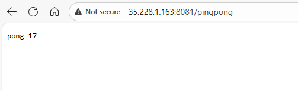

###  Exercise 3.2

- Branch: [3.2](https://github.com/VienThanh12/DevOps-with-Kubernetes/tree/3.2)
- Evidence:
  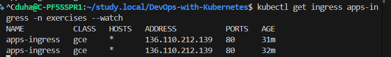
  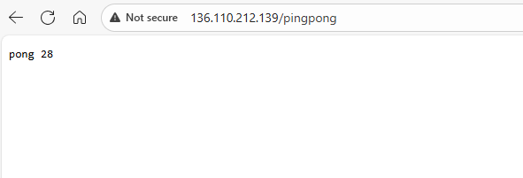
  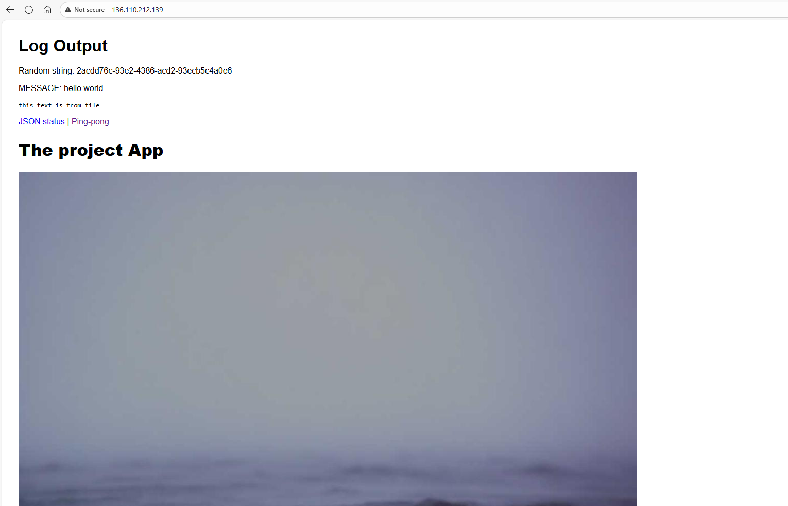

###  Exercise 3.3

- Branch: [3.3](https://github.com/VienThanh12/DevOps-with-Kubernetes/tree/3.3)
- Evidence:
  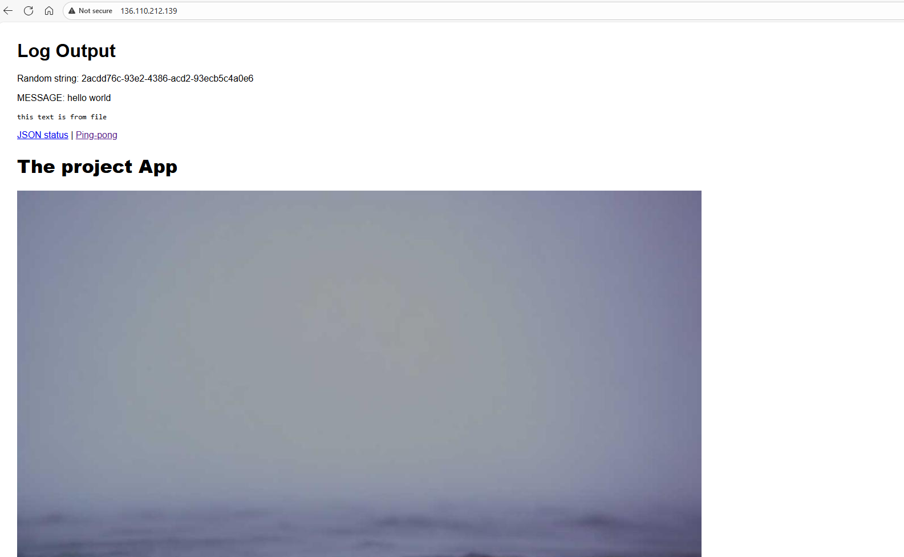
  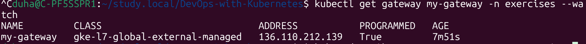
  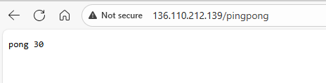

###  Exercise 3.4

- Branch: [3.4](https://github.com/VienThanh12/DevOps-with-Kubernetes/tree/3.4)
- Evidence:
  

###  Exercise 3.5

- Branch: [3.5](https://github.com/VienThanh12/DevOps-with-Kubernetes/tree/3.5)
- Evidence:
  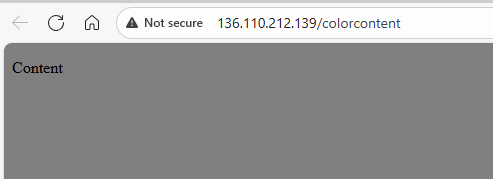

###  Exercise 3.6

- Branch: [3.6](https://github.com/VienThanh12/DevOps-with-Kubernetes/tree/3.6)
- Evidence:
  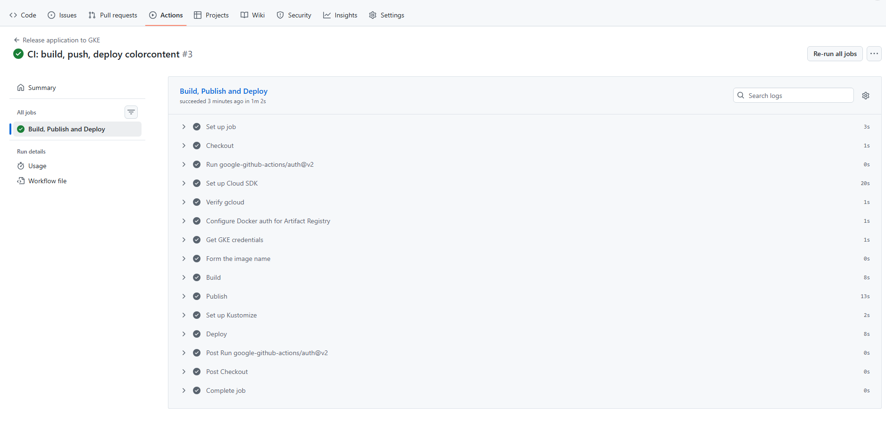

###  Exercise 3.7

- Branch: [3.7](https://github.com/VienThanh12/DevOps-with-Kubernetes/tree/3.7)

###  Exercise 3.8

- Branch: [3.8](https://github.com/VienThanh12/DevOps-with-Kubernetes/tree/3.8)

###  Exercise 3.9

- Branch: [3.9](https://github.com/VienThanh12/DevOps-with-Kubernetes/tree/3.9)

###  Exercise 3.10

- Branch: [3.10](https://github.com/VienThanh12/DevOps-with-Kubernetes/tree/3.10)
- Evidence:
  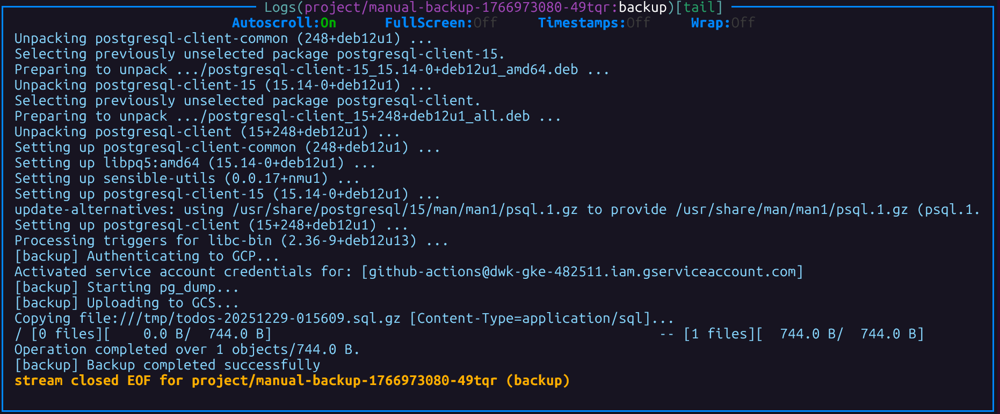
  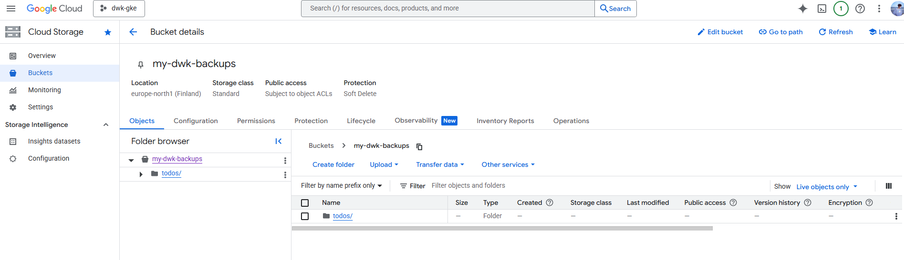

###  Exercise 3.11

- Branch: [3.11](https://github.com/VienThanh12/DevOps-with-Kubernetes/tree/3.11)
- Evidence:
  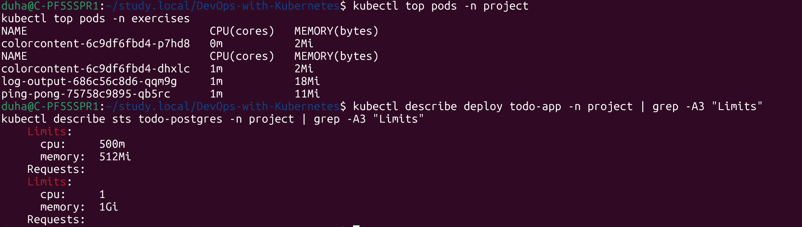

###  Exercise 3.12

- Branch: [3.12](https://github.com/VienThanh12/DevOps-with-Kubernetes/tree/3.12)
- Evidence:
  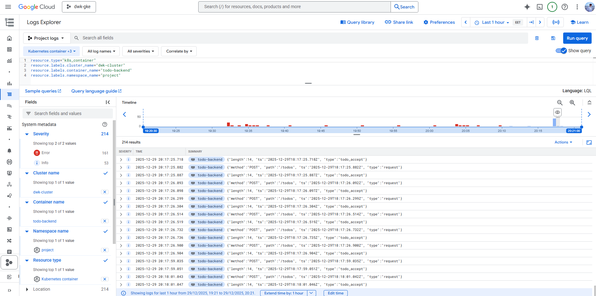
  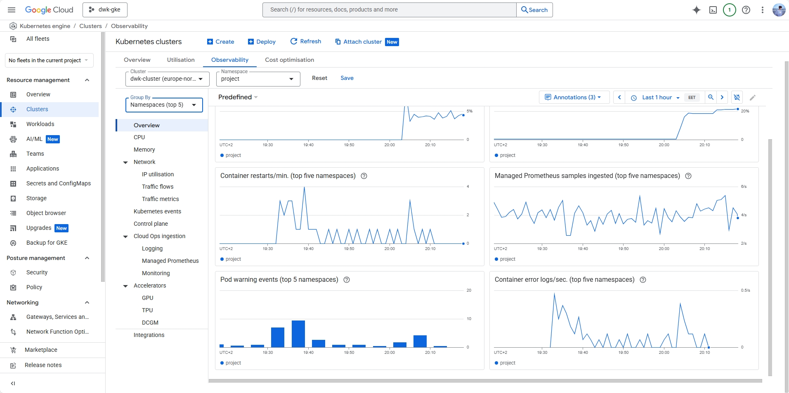

---

## ☁️ Chapter 4 – To the Cloud

###  Exercise 4.1

- Branch: [4.1](https://github.com/VienThanh12/DevOps-with-Kubernetes/tree/4.1)
- Evidence:
  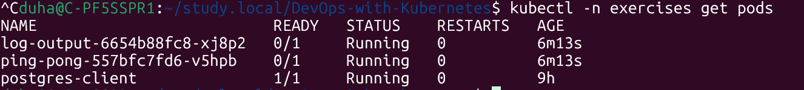
  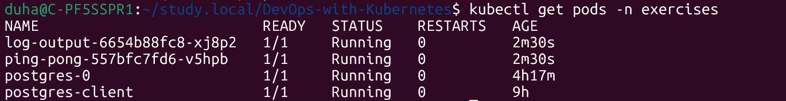

###  Exercise 4.2

- Branch: [4.2](https://github.com/VienThanh12/DevOps-with-Kubernetes/tree/4.2)
- Evidence:
  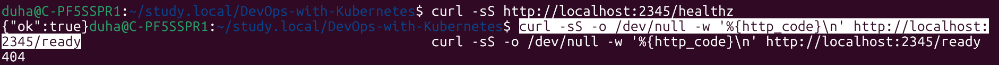

###  Exercise 4.3

- Branch: [4.3](https://github.com/VienThanh12/DevOps-with-Kubernetes/tree/4.3)
- Evidence:
  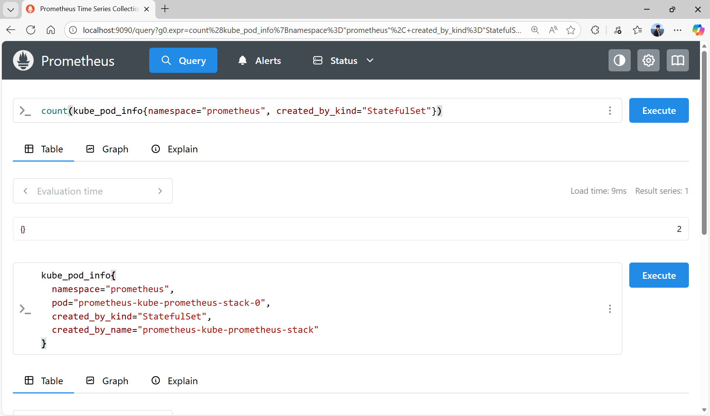

###  Exercise 4.4

- Branch: [4.4](https://github.com/VienThanh12/DevOps-with-Kubernetes/tree/4.4)
- Evidence:
  

###  Exercise 4.5

- Branch: [4.5](https://github.com/VienThanh12/DevOps-with-Kubernetes/tree/4.5)
- Evidence:
  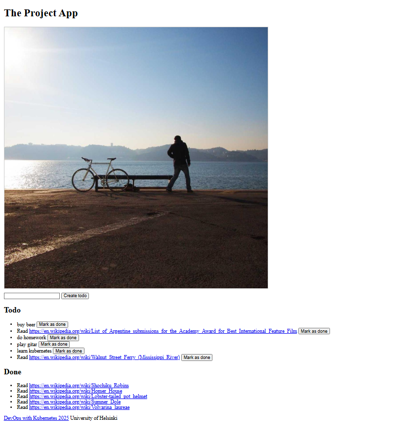

###  Exercise 4.6

- Branch: [4.6](https://github.com/VienThanh12/DevOps-with-Kubernetes/tree/4.6)
- Evidence:
  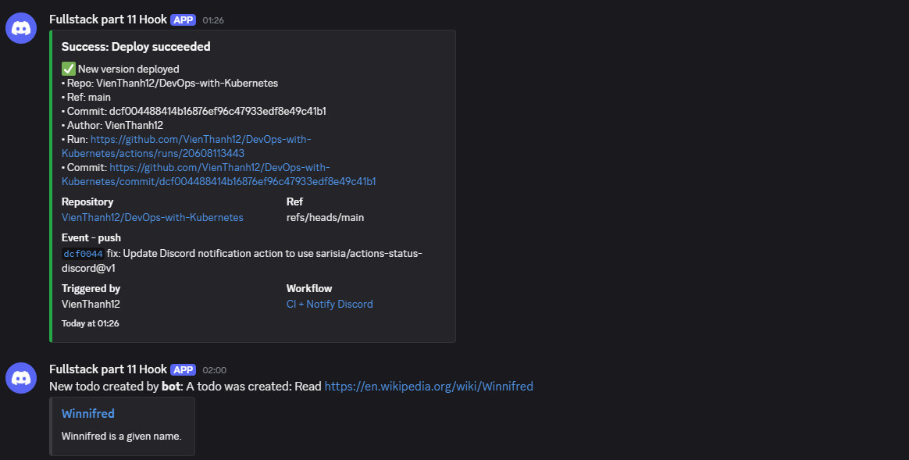
  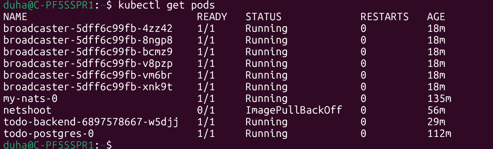
  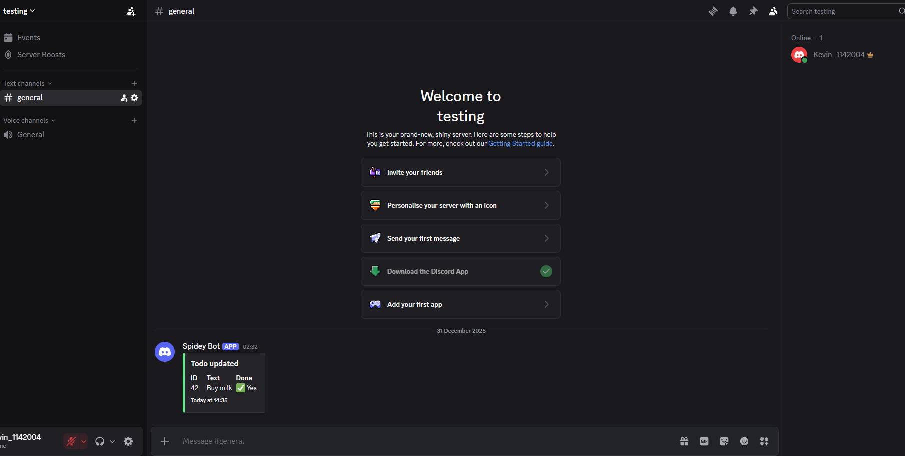
  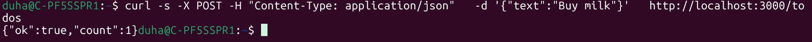

###  Exercise 4.7

- Branch: [4.7](https://github.com/VienThanh12/DevOps-with-Kubernetes/tree/4.7)

###  Exercise 4.8

- Branch: [4.8](https://github.com/VienThanh12/DevOps-with-Kubernetes/tree/4.8)
- Evidence:
  

###  Exercise 4.9

- Branch: [4.9](https://github.com/VienThanh12/DevOps-with-Kubernetes/tree/4.9)
- Evidence:
  
  
  
  

###  Exercise 4.10

- Branch: [4.10](https://github.com/VienThanh12/DevOps-with-Kubernetes/tree/4.10)
- Evidence:
  

---

## 🧩 Chapter 5 – Advanced Topics

###  Exercise 5.1

- Branch: [5.1](https://github.com/VienThanh12/DevOps-with-Kubernetes/tree/5.1)
- Evidence:
  
  

###  Exercise 5.6

- Branch: [5.6](https://github.com/VienThanh12/DevOps-with-Kubernetes/tree/5.6)
- Evidence:
  
  
  

A Knative Service was successfully deployed on k3d.
The revision was created and the workload pod reached Running state.
Due to corporate TLS interception, the Kourier ingress manifest could not be fetched.
The service was therefore verified by port-forwarding directly to the Knative revision pod, confirming correct Knative build, injection, and request handling.

---

## 📝 Notes – DBaaS (Cloud SQL) vs DIY PostgreSQL on GKE (PVC)

### 1. Initialization & Setup

**DBaaS (Google Cloud SQL)**

- ✅ Fast to initialize (minutes via UI / CLI / Terraform)
- ✅ No need to manage storage, replication, or failover
- ❌ Requires networking setup (private IP, Cloud SQL Proxy / connector)

**DIY (PostgreSQL on GKE with PVCs)**

- ❌ More setup work (StatefulSets, PVCs, StorageClasses)
- ❌ High availability and failover must be designed manually
- ✅ Full control over database configuration and deployment

---

### 2. Maintenance & Operations

**DBaaS**

- ✅ Automatic updates, patching, and security fixes
- ✅ Managed high availability and failover
- ❌ Limited control over internal PostgreSQL configuration
- ❌ Vendor lock-in to Google Cloud

**DIY**

- ❌ Manual upgrades, monitoring, and failure recovery
- ❌ Requires strong Kubernetes and database expertise
- ✅ Full control over PostgreSQL version and tuning
- ✅ Easier portability across environments

---

### 3. Backups & Recovery

**DBaaS**

- ✅ Automated daily backups
- ✅ Point-in-time recovery supported
- ✅ Simple restore via UI or CLI
- ❌ Limited customization of backup strategy

**DIY**

- ❌ Backups must be implemented manually (pg_dump, cronjobs, operators)
- ❌ Restore process is more complex and error-prone
- ✅ Full control over backup format, schedule, and storage location

---

### 4. Scalability & Reliability

**DBaaS**

- ✅ Easy vertical scaling (CPU / RAM)
- ✅ Built-in replication and high availability
- ❌ Limited horizontal scaling (read replicas only)

**DIY**

- ❌ Scaling and HA require additional tooling (operators, Patroni)
- ❌ Greater risk of misconfiguration
- ✅ Flexible for advanced or custom architectures

---

### 5. Costs

**DBaaS**

- ❌ Higher service cost due to managed features
- ❌ Pay for HA, backups, and availability even when underutilized
- ✅ Lower operational cost (less maintenance effort)

**DIY**

- ✅ Potentially lower infrastructure cost
- ❌ Higher operational and engineering effort
- ❌ Risk of downtime increases indirect costs

---

### 6. When to Choose Which

**Choose DBaaS when:**

- Reliability and data safety are top priorities
- Operational effort must be minimized
- Database expertise is limited

**Choose DIY when:**

- Full control and portability are required
- You want to learn or customize PostgreSQL deeply
- Cost optimization is critical and team expertise is sufficient

---

### Conclusion

DBaaS favors **simplicity, reliability, and low operational overhead** at a higher service cost, while DIY PostgreSQL on GKE offers **greater control and flexibility** but requires **significantly more maintenance and operational expertise**.
